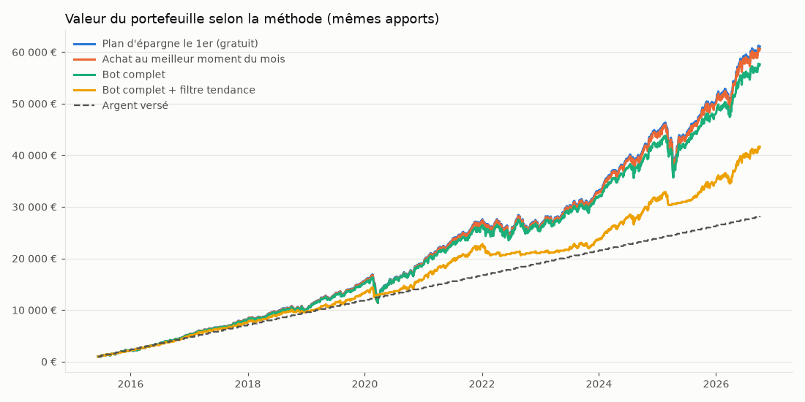

# Backtest sur données réelles

Période : 12/06/2015 → 01/10/2026. Actifs : iShares Core MSCI World  iShares Core MSCI EM IMI. Versement initial 1 000 € puis 200 € par mois. Frais Trade Republic : 1 € par ordre (le plan d'épargne est gratuit).

| Méthode | Valeur finale | Argent versé | Gain | Rendement annuel | Pire baisse | Ordres | Frais |
|---|---:|---:|---:|---:|---:|---:|---:|
| Plan d'épargne le 1er (gratuit) | 61 083 € | 28 200 € | +32 883 € | 10.82% | -33.3% | 204 | 0 € |
| Achat au meilleur moment du mois | 60 581 € | 28 200 € | +32 381 € | 10.60% | -33.3% | 193 | 193 € |
| Bot complet | 57 627 € | 28 200 € | +29 427 € | 9.97% | -31.2% | 171 | 171 € |
| Bot complet + filtre tendance | 41 623 € | 28 200 € | +13 423 € | 4.83% | -20.9% | 176 | 176 € |

*Rendement annuel* : performance hors apports (pondérée dans le temps). *Pire baisse* : plus forte chute du portefeuille entre un plus haut et un plus bas.

## Le score sur ^GSPC depuis 1950

| Score | Jours | Rendement moyen à 3 mois | à 12 mois | Positif à 12 mois | Pire cas à 12 mois |
|---|---:|---:|---:|---:|---:|
| 0-20 (cher) | 2 686 | +2.0% | +11.1% | 81% | -37.1% |
| 20-40 | 4 222 | +2.4% | +9.1% | 76% | -42.2% |
| 40-60 | 4 363 | +2.6% | +8.7% | 74% | -44.7% |
| 60-80 | 3 995 | +2.2% | +8.3% | 70% | -46.3% |
| 80-100 (soldé) | 3 094 | +1.8% | +10.4% | 71% | -48.8% |
| Tous les jours | 18 360 | +2.2% | +9.3% | 74% | -48.8% |

## Le score sur iShares Core MSCI World

| Score | Jours | Rendement moyen à 3 mois | à 12 mois | Positif à 12 mois | Pire cas à 12 mois |
|---|---:|---:|---:|---:|---:|
| 0-20 (cher) | 637 | +2.3% | +8.9% | 82% | -14.8% |
| 20-40 | 780 | +2.3% | +10.9% | 85% | -18.5% |
| 40-60 | 711 | +2.7% | +12.1% | 86% | -13.1% |
| 60-80 | 749 | +3.9% | +16.4% | 90% | -8.7% |
| 80-100 (soldé) | 494 | +6.0% | +18.0% | 95% | -4.5% |
| Tous les jours | 3 371 | +3.2% | +13.1% | 87% | -18.5% |

Les performances passées ne préjugent pas des performances futures.
