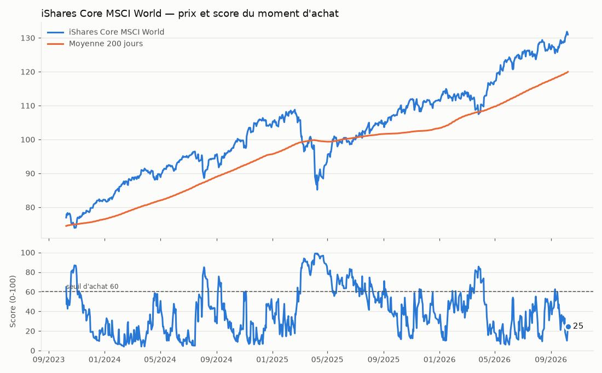

# Tableau de bord — 06/10/2026

✅ Rien à faire aujourd'hui : le bot attend le meilleur moment.

Score du moment : **10/100 — 🔴 marché très cher (au plus haut)**. iShares Core MSCI World est à -0.0% de son plus haut sur 1 an, +10.1% par rapport à sa moyenne 200 jours, RSI 70.

Historiquement (^GSPC depuis 1950), quand le score était dans la tranche 0-20 (cher) : **+11.1% en moyenne 12 mois plus tard**, positif dans 81% des cas (tous jours confondus : +9.3%, 74%).

## Portefeuille suivi

Portefeuille suivi : aucune position ; réserve 0 € ; en attente d'investissement 200 €. Valeur des positions : 0 €.

Apport mensuel : 200 € — proposé dès que le score atteint 60, au plus tard le 20 du mois.

## Statistiques du score

**^GSPC** :

| Score | Jours | Rendement moyen à 3 mois | à 12 mois | Positif à 12 mois | Pire cas à 12 mois |
|---|---:|---:|---:|---:|---:|
| **0-20 (cher) ← aujourd'hui** | 2 689 | +2.0% | +11.1% | 81% | -37.1% |
| 20-40 | 4 222 | +2.4% | +9.1% | 76% | -42.2% |
| 40-60 | 4 363 | +2.6% | +8.7% | 74% | -44.7% |
| 60-80 | 3 995 | +2.2% | +8.3% | 70% | -46.3% |
| 80-100 (soldé) | 3 094 | +1.8% | +10.4% | 71% | -48.8% |
| Tous les jours | 18 363 | +2.2% | +9.3% | 74% | -48.8% |

**Commandes** (en commentaire de n'importe quel ticket) :
- `oui` : j'ai passé les ordres proposés → le bot les enregistre
- `non` : je ne fais rien → le bot repropose dans 7 jours
- `apport 300` : changer l'apport mensuel (en €)
- `capital 2000` : ajouter une somme ponctuelle à investir
- `possede EUNL.DE 12` : déclarer des parts que vous avez déjà
- `aide` : afficher cette aide

#### 🔎 Radar (3064 actions et ETF suivis, 755 soldés aujourd'hui)
- ⭐ **IG Group** (action, chercher « IG Group ») — score **99/100**, -51% depuis son plus haut ; historiquement à ce niveau : +21% à 12 mois en moyenne, positif 75% des cas (moyenne du titre : +12%)
  - 📰 🟠 à vérifier : baisse bien plus forte que le marché, 4 article(s) à regarder (3 mois : -52% vs marché)
    - ⚠️ [UK's IG Group plans significant layoffs, Sky News reports - Reuters](https://news.google.com/rss/articles/CBMiogFBVV95cUxQdzI4SXdIZU5Fa1RWZnlrbms5VlVwZ2VRM2U5NEE4ZkV6SkxtQ2syME5XWXdJc2dVOUV3eTQ3cHNSeHlWUTVDZFlhX2hCaHU0dlEtZVVMMVdYZDlIUmJHR2dlMnBYRExhSnppNzRJMVpTZC11elJfZ1V6LThtOGdMc1pkWml3c2FPNkxCSzU4RHZDZG95N05HSTE0cFNsRWxQeWc?oc=5) (layoffs)
    - ⚠️ [IG Group shares plunge 25% as Peel Hunt flags revenue and margin downgrade - Proactive financial news](https://news.google.com/rss/articles/CBMi3AFBVV95cUxOTzNoQXR4UUZkR19URmlSWXFFNWxsSE4tVlZLTVRuMDdpRXEwLThnYW5WS2JMdlJFbWhHamJkd0p0Q0RCYmZwYXZ3bHdOTV90Rk1WRTJSaElNakdiWW0xalJVMkYybEVLU0ZYblRxbnd5dkRDQlJUUzJrd1VfUnM5OGZpSmNpd0xkck5fbVppbFZnTGU3dzNpSktwNW41VV9taUhsZjM1NFEzLTFsY19EcDNFaDc1S2huSW5Ddk9GRGRRQVhndU1fcHpNX0M2cWZfYnBBNk42QmJJcDJJ?oc=5) (downgrade)
    - ⚠️ [IG Group Shares Plunge c25% After De Facto Profit Warning - Share Talk](https://news.google.com/rss/articles/CBMijAFBVV95cUxQYnVXR3cybHZiR2NSSXpJbnpjYVlwOHhDSDJ0OHQ3YnhBejJpak9BV1pReXBPc2pnd3ViclBHTXhyQ2NkazI3Q1JnT1FEWGszeHdSazBOdjdQTnMxcEdnOGxUYlJFV2JYTVlMUW1CTUFoeHRtd0RCNFYzWlEwdU5nYm1vR1BzdXNfNlR2VA?oc=5) (profit warning)
- ⭐ **Bilfinger** (action, chercher « Bilfinger ») — score **98/100**, -56% depuis son plus haut ; historiquement à ce niveau : +26% à 12 mois en moyenne, positif 59% des cas (moyenne du titre : +18%)
  - 📰 🟠 à vérifier : baisse bien plus forte que le marché, 2 article(s) à regarder (3 mois : -38% vs marché)
    - ⚠️ [Bilfinger stock heads into the open after guidance cut and 1.1% gain - AD HOC NEWS](https://news.google.com/rss/articles/CBMizgFBVV95cUxOVmVWLUJQLVkwVVREUi1ubzdYSVpSUGhiRS1WeUR2LUxNeUpGcmRzekt0REJBa1RjcFhpbUQ0UU9QOElOTEJsNldGZU1GM3puNG1FOHllYTE3dVJRVm5TWWpVbWJUdE9OSzd3eEwzRTVXUk5VUXB3azlDMXVaejE3YkxsRTZlVHdvbG4tZWxTRmU0N25vaW5GZDVMdFlPM1lzUW5hb21HUTdIQjhTRjdNM0lGdFpjRkJLLTcyNE9nbnNIaHlpNENhSjFMeVVJQQ?oc=5) (guidance cut)
    - ⚠️ [Bilfinger's Guidance Cut Triggers Analyst Reckoning as Agile Restructuring Takes Shape - AD HOC NEWS](https://news.google.com/rss/articles/CBMi3wFBVV95cUxNczhZQmtQMVZSdUw4bTdBSFJRTlFLaGo5azhkQUJnNGg5dXkzWk9rZXdyZXlxeWJTMmE5NXFSLXUtelV3VDdKd1Z4QVE1NjZRY1dyQUlmTUNReWtNMHl3TUZpN194VDBya1c5WkVhZFhvdzNjZ2Z4ZTNnejNvV1EyalZhUnpjX0NNUG94Q3NGSjB0dk9SVlN3WWZfUG1YTW5GbEtNRjZ2R1dweVFSUGp1MjdFWGVRd2V6LXEwWllXYThOS3lYYmEzRFNaTlNYTDA1NGwyM0hPYkRXaXlJZGk4?oc=5) (guidance cut)
- ⭐ **Leidos** (action, chercher « Leidos ») — score **98/100**, -42% depuis son plus haut ; historiquement à ce niveau : +21% à 12 mois en moyenne, positif 75% des cas (moyenne du titre : +16%)
  - 📰 🟢 rien d'alarmant dans l'actualité (1 article(s) mineur(s), courant pour une grande entreprise) (3 mois : +4% vs marché)
    - ⚠️ [Northern Virginia Tech Company Anticipates Major Layoffs In Ashburn - Patch](https://news.google.com/rss/articles/CBMioAFBVV95cUxOWnE5TUdsTng5T1VuQThRRGJGZ1pLYzBLbERnSWo5SUtQSFBJc0xfdFBuV0FqX3dkMmd4VDlGRzNmaXB4YXR5Qmd2c2FPRVl3OFo4WUpWNFZuSXY0ckQ4aFplcW5ETk5HZ01zT24wWEJYREdoWmxfTUJCZkRRQjRZOTJvbU5pSFBYUWhwZGphd0dKVTdMRkdUQmtCWURvdk5D0gG2AUFVX3lxTE54NG5pWkNRVmZIM3d1ckMtWFlIYnBSdnNFdmgtRzBCaXhjT1ZFVlE5Q2VDVVA0V0hYY2ZZVWVDNHIwWDZYa3lPQUdPSWExVmVYVWtCdV9BTXV6V2M2RF85YXBoNUx3eGczbGprZU9vb1dCNTZiQ3pxeGI0dDN3U1dRSGZoS2VfRlkxTmM5SGV1WTE0dVF4cUplRlRUUEQ0MU1xdmRuRlMyMldtb2dMWU44LVZyNkJR?oc=5) (layoffs)
- ⭐ **Northrop Grumman** (action, chercher « Northrop Grumman ») — score **98/100**, -38% depuis son plus haut ; historiquement à ce niveau : +18% à 12 mois en moyenne, positif 83% des cas (moyenne du titre : +17%)
  - 📰 🟢 rien d'alarmant dans l'actualité (3 article(s) mineur(s), courant pour une grande entreprise) (3 mois : -14% vs marché)
    - ⚠️ [RBC Just Downgraded Northrop Grumman Stock. Here's Why - Barchart.com](https://news.google.com/rss/articles/CBMingFBVV95cUxPUjI0Vms5ME9VVl9jTTZfbnVweEtTU0dlaDBhbThCQ1lOVlJGcFF0R09ma0tyZnBuOVNDamtKanpiUGVHRmhVX0ZKRkh1MXFzX0RoVW5ybThXa2tJV3ZkNFFON0U1X2pLX0Y5LW5vZkJubjVHb0hIem51NVdOLUs2ZUYxNnJJYlZNYWJ1YUsxRzVSaTVqMHZRbkc3Rll1Zw?oc=5) (downgraded)
    - ⚠️ [Northrop Grumman downgraded at RBC on lower growth outlook; Arxis upgraded (NOC:NYSE) - Seeking Alpha](https://news.google.com/rss/articles/CBMisAFBVV95cUxNSXVSSEF0SWgwUWM1SlEtYUZkOGgydVpaT2tTVmM2Qk9FWVprX3ByY0MwYzJ1amFOejNpcjk3YVFvV1g3VDhMRFhiNDdHb2ZrN295S2V0eGNtWkJmZktMWUk2RGNJSGI5Z1VfZkNjSDBxUnpxOGc0UTViOGhPb2VoWklMbVA5Nmg4VTJmdHowMWJRU3NJWVVqZ29SUHdhanltSmdaMC1WMk9JUVZsOXNPXw?oc=5) (downgraded)
    - ⚠️ [Northrop Grumman Downgraded To ‘Sector Perform’ – RBC Says 6% Sales Growth From 2026 Through 2028 Could Be Best-Case Scenario - Stocktwits](https://news.google.com/rss/articles/CBMikgJBVV95cUxPNFhkZGhMU3BWX09qLTRVRjlnMEZXSlR3eVM2ZU1rNUZxRHNDX3U3MGFJRl9oeEdGSGNIeHUzcVZ5QzRmV1ZwV3luSTRuV3V0a3Y1a3lPQjBFTndNVnpTRkdfOW1VSVJvQ0hvdHRrNnNxREJFTWxIZHBtTVhTQ1lvN2xzRjNVUk8yQWZMU1RaczBjUDVuMDh4MkR3UVlLMXg5dTN5UEFHTEdNbkxvVkpMS1FHWWdaSGdUN25Md2xGaU1wWndfczRsMHQ0Y0dBTkNzaWF1cGNEYTl1aWx2XzhZN2ZybkxZV2Q5UkhGaUdNR09GTWdlU3FYRXZMejZvRFo3MC0xYk1KRUlFaWRPXzgxak1B?oc=5) (downgraded)
- ⭐ **WSP Global Inc.** (action, chercher « WSP Global Inc. ») — score **98/100**, -43% depuis son plus haut ; historiquement à ce niveau : +39% à 12 mois en moyenne, positif 98% des cas (moyenne du titre : +22%)
  - 📰 🟢 rien d'alarmant dans l'actualité (3 mois : -11% vs marché)
- ⭐ **C.H. Robinson** (action, chercher « C.H. Robinson ») — score **98/100**, -35% depuis son plus haut ; historiquement à ce niveau : +19% à 12 mois en moyenne, positif 74% des cas (moyenne du titre : +15%)
  - 📰 🟠 à vérifier : baisse bien plus forte que le marché, 1 article(s) à regarder (3 mois : -33% vs marché)
    - ⚠️ [New lawsuit approach: accusing C.H. Robinson, TQL of RICO violations - FreightWaves](https://news.google.com/rss/articles/CBMioAFBVV95cUxNNzMzZFNmOENTV2hlT3B1eTVWY3RPOHZicjFrR01ldkZYRzJVeUgtdDhvcG0zVHdXTUlVLV9PRWV5eFNaNkE4WUNSS0xvY1J3WFVnQ1BobEVmTFNyNXNBaC1iV1NhcnlLblEzM2ZBM2c3TVkzbjkzdzh5NS1HSEJERUFGOXh3b2pOQzEyUXV2bXFxdGxLakJXeEpmdTQxbC1B?oc=5) (lawsuit)
- ⭐ **Watsco** (action, chercher « Watsco ») — score **98/100**, -38% depuis son plus haut ; historiquement à ce niveau : +23% à 12 mois en moyenne, positif 75% des cas (moyenne du titre : +21%)
  - 📰 🟠 à vérifier : baisse bien plus forte que le marché, sans article inquiétant trouvé (3 mois : -28% vs marché)
- ⭐ **McDonald's** (action, ISIN `US5801351017`) — score **98/100**, -31% depuis son plus haut ; historiquement à ce niveau : +34% à 12 mois en moyenne, positif 98% des cas (moyenne du titre : +17%)
  - 📰 🟠 à vérifier : baisse bien plus forte que le marché, 11 article(s) à regarder (3 mois : -19% vs marché)
    - ⚠️ [Un Big Mac 21% plus cher à seulement 3 km: McDonald’s est visé par une plainte qui l'accuse d'utiliser l’IA pour fixer des prix différents selon la localisation (mais le géant américain s'en défend) - BFM](https://news.google.com/rss/articles/CBMi-AJBVV95cUxQVHNGeF9BZy13eEhFcUloeU44ZXFrbEpyd0lwTUhVbExwZ3BnRGJLMDYxOEwwVmVqVVF6T0t6N2VHZGtUb2F1d040ZjY1NDc5TGs3Z1JyVHZDcTBCMS1BRFhEZV9hb1dVRVo5Q0lldF9zaXcxU2JESnp1ODhVdWtxbUxMRXR5QXJkVWE4c2Z2MUZMSEF3LVphckFZSFhYT1hHQlg0ajhTUy1TZUpIYjBEaXEyaUpkUXRxR1JmOE9mMTJmd0tfY1ZmX2FBZWVBZWV6djI5czluQ0RZVUI5MzJRR1BuR0k3Q3JQbVpiZWRmcHZyN2JJSm45T2hrS3dWeGxSSGZ1VmhpVWEwckJxS2FITnh1VDhuaEpjVi02UkJfU3UzaTNSV0ZiQjlNbjdvbDhxbUkwWXFyTEJTc2U1ZEZWNE84T0FyTnVaRzhDX2dTQlhuN1lUWE9KcTR5bE4wQldsNTE4RkkyZkxGNG9vZFBxZmU2dlZIN1dr?oc=5) (plainte)
    - ⚠️ [McDonald’s Faces Nationwide Class Action Claiming AI Pricing Raised Big Mac Prices - Law Commentary](https://news.google.com/rss/articles/CBMihwFBVV95cUxPSU9BOEZEOXFyMVNhMUZlcF9ZMUtxaHljMDB0QzVlUVp0dVZmdmhxUGJBRk5JNDlmeEM5TnQ4MG9PTFNscExmeFQ0VFVuR3d4bzBmYk9LbGc1OFNPZGxicjJJTXdtd1hVWGV5aENQM2tOYWFMb0w4cGVQWVVqaG5tc09jeHRlaTQ?oc=5) (class action)
    - ⚠️ [McDonald’s sued over AI tool that recommends prices to US franchisees - AP News](https://news.google.com/rss/articles/CBMisgFBVV95cUxNY19ra2dQcnBhTDhWS3MwZ3FJOGlqOFlodHFBSXVYdG9XNnA2LUotWnJKU215N040Q3VicU9hR0tTdHZpT3R5R3RwejJIZndFTmV6UXdXS1VNbTBQcHBOTUlFMWI1M0gxRUZiWTAtanFHS1Nxald1S3BDN3M1UFUwRWZybXdSWlIxeFZaOV9EWmtBcVZLRXNlMTQyQ21ZUm5jLVBsdE5ObjAxSFNKZ0ZmcFNR?oc=5) (sued)
- ⭐ **Acushnet Company** (action, chercher « Acushnet Company ») — score **97/100**, -32% depuis son plus haut ; historiquement à ce niveau : +37% à 12 mois en moyenne, positif 94% des cas (moyenne du titre : +24%)
  - 📰 🟠 à vérifier : baisse bien plus forte que le marché, sans article inquiétant trouvé (3 mois : -32% vs marché)
- ⭐ **Curtiss-Wright** (action, chercher « Curtiss-Wright ») — score **97/100**, -36% depuis son plus haut ; historiquement à ce niveau : +23% à 12 mois en moyenne, positif 78% des cas (moyenne du titre : +22%)
  - 📰 🟠 à vérifier : baisse bien plus forte que le marché, 3 article(s) à regarder (3 mois : -37% vs marché)
    - ⚠️ [Curtiss-Wright CFO steps down - TradingView](https://news.google.com/rss/articles/CBMilwFBVV95cUxQUjZJNUZSZmRYQU9mRkswQ0Z5NkJEREFWMUFjazMyVHJjZ0JHNWdNSFJ1ODNXUWoyNno4SUluUVlwZ0JDN2RkREoyN0J3UmtZRFVFdjRhVEJkSUdfRlZZRkI5ekt4RHZXVVIwNjhDa2U1eEJ2eEU4QV9ySmtnMzJvTjBnSXktOGhOM1UwWnNBMkM2UkhpaXZF?oc=5) (steps down)
    - ⚠️ [L’action Curtiss-Wright recule après la démission du directeur financier - Investing.com France](https://news.google.com/rss/articles/CBMixAFBVV95cUxOZ2IydHdmRGFCSUY4YTdrSVRKcU9YMThzclNOVXZSeFF0NV9mM3ZuTXRKOXE0ZTkxRV81Z2J5dzEwUmg3WTFidi15SmliUnBHVDRBNklFdjlONEJEUFBHQ09wWTh0OVJucTEwMkIwTzlOUmNhRXBSN0g3b0U1Ym52VHVnTThoX3JTX2Q1V3U2Y2Y3bHZMUUl5SWxnaXlNVjRISkxqNGRrQVc4eHFmdGdmblVQRG5jdXV0TlJaVVFUdG5wbEwx?oc=5) (demission)
    - ⚠️ [Curtiss-Wright (NYSE:CW) Stock Drops 9% Today After CFO Steps Down - kalkine.ca](https://news.google.com/rss/articles/CBMingFBVV95cUxQU3BUbVZZY3RCVTA3Vk5vVWhTMkZySTBfTGtkdllaN25VRk9QcldJTk9Tdk0tTEhmYU5aZURSNWtYbHZOdk5FWUV6ZHVjU3dPNTdtdGVBVXBpVVEtVUR6UW1ZXzlHRXhMYUhrWEdPdUozUGpnWFV1bk9jVGhubFhKT0t1eTN5a29VYTI3VXIxNHpod1lBM09MSjVwaDI4QQ?oc=5) (steps down)
- ⭐ **Vici Properties** (action, chercher « Vici Properties ») — score **97/100**, -24% depuis son plus haut ; historiquement à ce niveau : +16% à 12 mois en moyenne, positif 89% des cas (moyenne du titre : +6%)
  - 📰 🟢 rien d'alarmant dans l'actualité (6 article(s) mineur(s), courant pour une grande entreprise) (3 mois : -14% vs marché)
    - ⚠️ [VICI Properties: I'm Flipping From Buy To Sell (Rating Downgrade) (NYSE:VICI) - Seeking Alpha](https://news.google.com/rss/articles/CBMipAFBVV95cUxPRTdDdXJjZFB3bHRKOTl0eXJIYzNDdDNGeUxCTkt4NzBQb2ZLaUlCR1NpaGFjWlRrTDhlY3o4SllkVm5ZNHVqM2x5a0hVanZ5MmJVQ2ktMkRoaXAwMUdOanFEVzNJQmUxU3ZNREdGV2hudGdhRzFhMVJOZXN4bktvMm5ISnJpRkNvQ2hfd0o1ajZONEhXTDNZNmdjNDBsNGNGcl9kXw?oc=5) (downgrade)
    - ⚠️ [VICI Properties Shares Fall After JPMorgan Downgrade - Yahoo Finance](https://news.google.com/rss/articles/CBMiowFBVV95cUxNX0prWkt3elVjZDRkcWxHQmMtUy1McksybUgzM1NmMjF4aHFldjd4ck1GckhVYkdFU0ozaEhmTmR0eGhFb2dKYjB5SE44ckEzQXJYWTRiMUdEbWpQVWtIeG1KMGwyRndNMW9aZWZyRzhPbzhkN0tFMTZLN0tsYnVXaGV6RXU2VGJpZVpnOVdvSWs1OHFiQVRWcWtNU3k3WkdueURV?oc=5) (downgrade)
    - ⚠️ [VICI Properties (NYSE:VICI) Shares Down 1.9% After Analyst Downgrade - MarketBeat](https://news.google.com/rss/articles/CBMiwgFBVV95cUxNMHBLenlyeVVBZFQtT0h4QkZ4dklSUXF0RnZjSkVSY01GVWh3Y29MOUVBakNMcU1ORktzLTZCc0s5Sk5LNWpaV2VyVk0tZTRtQ1FzY1kxOXJZVEhZSm1HOURqQk41alVzdWd4WmZxZnhoSjliZkpYX2lOT2NrLXhVb043aTBpRjlCUy1pRVpWTGxpSGVUVDdQSF9UVFllaklVNnVza0ZyTUlBaDZKejBWNjQ3LVlVdjctaHZfRTFqLW5PQQ?oc=5) (downgrade)
- ⭐ **Pan Pacific International Holdings Corp.** (action, chercher « Pan Pacific International Holdings Corp. ») — score **97/100**, -35% depuis son plus haut ; historiquement à ce niveau : +23% à 12 mois en moyenne, positif 74% des cas (moyenne du titre : +19%)
  - 📰 🟠 à vérifier : baisse bien plus forte que le marché, sans article inquiétant trouvé (3 mois : -18% vs marché)
- ⭐ **Ferrovial** (action, chercher « Ferrovial ») — score **97/100**, -31% depuis son plus haut ; historiquement à ce niveau : +16% à 12 mois en moyenne, positif 76% des cas (moyenne du titre : +15%)
  - 📰 🟠 à vérifier : baisse bien plus forte que le marché, 1 article(s) à regarder (3 mois : -25% vs marché)
    - ⚠️ [Ferrovial downgraded to Neutral from Overweight at JPMorgan - TipRanks](https://news.google.com/rss/articles/CBMirgFBVV95cUxOMXlDNUh6ZUs5OU1KSVpvVjduRGVKUWNHVWUzcTUwdzRVRmNKS2w5eHlmMFlJRENXN004NGtVVHdFY0lSVGl2YktRSmgxUGRIN2N6eklMWEJhN2NkR2JvbFVWbUY0NkItYWtyUDhLR3NyTmFmLXQ3bHpHbGNJOUFWclgwVE1VWTY0eXZKTTFhcHUxYzhLRlR4Q0xycXB4cHlYYzZkaloyV1FSdnhWYVE?oc=5) (downgraded)
- ⭐ **Four Corners Property Trust, Inc.** (action, chercher « Four Corners Property Trust, Inc. ») — score **97/100**, -19% depuis son plus haut ; historiquement à ce niveau : +17% à 12 mois en moyenne, positif 73% des cas (moyenne du titre : +5%)
  - 📰 🟠 à vérifier : baisse bien plus forte que le marché, sans article inquiétant trouvé (3 mois : -17% vs marché)
- ⭐ **Post Holdings** (action, chercher « Post Holdings ») — score **97/100**, -37% depuis son plus haut ; historiquement à ce niveau : +21% à 12 mois en moyenne, positif 78% des cas (moyenne du titre : +12%)
- ⭐ **National Health Investors, Inc.** (action, chercher « National Health Investors, Inc. ») — score **97/100**, -27% depuis son plus haut ; historiquement à ce niveau : +26% à 12 mois en moyenne, positif 93% des cas (moyenne du titre : +16%)
- ⭐ **CRH plc** (action, chercher « CRH plc ») — score **96/100**, -37% depuis son plus haut ; historiquement à ce niveau : +22% à 12 mois en moyenne, positif 75% des cas (moyenne du titre : +16%)
- ⭐ **Installed Building Products, Inc.** (action, chercher « Installed Building Products, Inc. ») — score **96/100**, -46% depuis son plus haut ; historiquement à ce niveau : +50% à 12 mois en moyenne, positif 77% des cas (moyenne du titre : +30%)
- ⭐ **Patrick Industries, Inc.** (action, chercher « Patrick Industries, Inc. ») — score **96/100**, -55% depuis son plus haut ; historiquement à ce niveau : +79% à 12 mois en moyenne, positif 66% des cas (moyenne du titre : +51%)
- ⭐ **Las Vegas Sands** (action, chercher « Las Vegas Sands ») — score **96/100**, -48% depuis son plus haut ; historiquement à ce niveau : +38% à 12 mois en moyenne, positif 56% des cas (moyenne du titre : +22%)
- ⭐ **Emera Incorporated** (action, chercher « Emera Incorporated ») — score **96/100**, -15% depuis son plus haut ; historiquement à ce niveau : +19% à 12 mois en moyenne, positif 91% des cas (moyenne du titre : +13%)
- ⭐ **Getty Realty Corp.** (action, chercher « Getty Realty Corp. ») — score **95/100**, -23% depuis son plus haut ; historiquement à ce niveau : +17% à 12 mois en moyenne, positif 82% des cas (moyenne du titre : +10%)
- ⭐ **Huntington Ingalls Industries** (action, chercher « Huntington Ingalls Industries ») — score **95/100**, -42% depuis son plus haut ; historiquement à ce niveau : +30% à 12 mois en moyenne, positif 82% des cas (moyenne du titre : +16%)
- ⭐ **RB Global** (action, chercher « RB Global ») — score **95/100**, -32% depuis son plus haut ; historiquement à ce niveau : +21% à 12 mois en moyenne, positif 84% des cas (moyenne du titre : +18%)
- ⭐ **Agree Realty** (action, chercher « Agree Realty ») — score **95/100**, -19% depuis son plus haut ; historiquement à ce niveau : +21% à 12 mois en moyenne, positif 75% des cas (moyenne du titre : +15%)
- ⭐ **Eagers Automotive** (action, chercher « Eagers Automotive ») — score **95/100**, -46% depuis son plus haut ; historiquement à ce niveau : +42% à 12 mois en moyenne, positif 68% des cas (moyenne du titre : +29%)
- ⭐ **Gaming and Leisure Properties** (action, chercher « Gaming and Leisure Properties ») — score **95/100**, -20% depuis son plus haut ; historiquement à ce niveau : +39% à 12 mois en moyenne, positif 98% des cas (moyenne du titre : +11%)
- ⭐ **AutoNation** (action, chercher « AutoNation ») — score **95/100**, -32% depuis son plus haut ; historiquement à ce niveau : +34% à 12 mois en moyenne, positif 70% des cas (moyenne du titre : +18%)
- ⭐ **AGNC Investment** (action, chercher « AGNC Investment ») — score **95/100**, -23% depuis son plus haut ; historiquement à ce niveau : +14% à 12 mois en moyenne, positif 71% des cas (moyenne du titre : +8%)
- ⭐ **CAR Group** (action, chercher « CAR Group ») — score **94/100**, -38% depuis son plus haut ; historiquement à ce niveau : +24% à 12 mois en moyenne, positif 88% des cas (moyenne du titre : +16%)
- ⭐ **Winmark** (action, chercher « Winmark ») — score **94/100**, -38% depuis son plus haut ; historiquement à ce niveau : +36% à 12 mois en moyenne, positif 85% des cas (moyenne du titre : +22%)
- ⭐ **MGE Energy, Inc.** (action, chercher « MGE Energy, Inc. ») — score **94/100**, -17% depuis son plus haut ; historiquement à ce niveau : +16% à 12 mois en moyenne, positif 82% des cas (moyenne du titre : +10%)
- ⭐ **Terna** (action, chercher « Terna ») — score **94/100**, -13% depuis son plus haut ; historiquement à ce niveau : +20% à 12 mois en moyenne, positif 95% des cas (moyenne du titre : +13%)
- ⭐ **Realty Income** (action, chercher « Realty Income ») — score **94/100**, -19% depuis son plus haut ; historiquement à ce niveau : +19% à 12 mois en moyenne, positif 80% des cas (moyenne du titre : +13%)
- ⭐ **Enbridge** (action, ISIN `CA29250N1050`) — score **94/100**, -17% depuis son plus haut ; historiquement à ce niveau : +20% à 12 mois en moyenne, positif 86% des cas (moyenne du titre : +15%)
- ⭐ **Gjensidige Forsikring** (action, chercher « Gjensidige Forsikring ») — score **94/100**, -13% depuis son plus haut ; historiquement à ce niveau : +18% à 12 mois en moyenne, positif 83% des cas (moyenne du titre : +15%)
- ⭐ **AeroVironment** (action, chercher « AeroVironment ») — score **94/100**, -66% depuis son plus haut ; historiquement à ce niveau : +27% à 12 mois en moyenne, positif 72% des cas (moyenne du titre : +21%)
- ⭐ **Gildan Activewear Inc.** (action, chercher « Gildan Activewear Inc. ») — score **94/100**, -40% depuis son plus haut ; historiquement à ce niveau : +39% à 12 mois en moyenne, positif 68% des cas (moyenne du titre : +22%)
- ⭐ **Lennox International** (action, chercher « Lennox International ») — score **94/100**, -37% depuis son plus haut ; historiquement à ce niveau : +35% à 12 mois en moyenne, positif 83% des cas (moyenne du titre : +22%)
- ⭐ **NNN Reit** (action, chercher « NNN Reit ») — score **94/100**, -19% depuis son plus haut ; historiquement à ce niveau : +21% à 12 mois en moyenne, positif 82% des cas (moyenne du titre : +12%)
- ⭐ **Ferrovial** (action, chercher « Ferrovial ») — score **94/100**, -28% depuis son plus haut ; historiquement à ce niveau : +17% à 12 mois en moyenne, positif 73% des cas (moyenne du titre : +13%)
- ⭐ **Bank of Hawaii** (action, chercher « Bank of Hawaii ») — score **93/100**, -22% depuis son plus haut ; historiquement à ce niveau : +20% à 12 mois en moyenne, positif 80% des cas (moyenne du titre : +9%)
- ⭐ **Fidelity National Financial** (action, chercher « Fidelity National Financial ») — score **93/100**, -30% depuis son plus haut ; historiquement à ce niveau : +34% à 12 mois en moyenne, positif 83% des cas (moyenne du titre : +18%)
- ⭐ **RB Global, Inc.** (action, chercher « RB Global, Inc. ») — score **93/100**, -30% depuis son plus haut ; historiquement à ce niveau : +15% à 12 mois en moyenne, positif 81% des cas (moyenne du titre : +14%)
- ⭐ **Annaly Capital Management** (action, chercher « Annaly Capital Management ») — score **93/100**, -22% depuis son plus haut ; historiquement à ce niveau : +15% à 12 mois en moyenne, positif 73% des cas (moyenne du titre : +9%)
- ⭐ **Stantec Inc.** (action, chercher « Stantec Inc. ») — score **93/100**, -40% depuis son plus haut ; historiquement à ce niveau : +25% à 12 mois en moyenne, positif 84% des cas (moyenne du titre : +19%)
- ⭐ **Sienna Senior Living Inc.** (action, chercher « Sienna Senior Living Inc. ») — score **93/100**, -17% depuis son plus haut ; historiquement à ce niveau : +18% à 12 mois en moyenne, positif 71% des cas (moyenne du titre : +14%)
- ⭐ **Metrics Master Income Trust** (action, chercher « Metrics Master Income Trust ») — score **93/100**, -9% depuis son plus haut ; historiquement à ce niveau : +7% à 12 mois en moyenne, positif 87% des cas (moyenne du titre : +7%)
- ⭐ **Essential Properties Realty Trust, Inc.** (action, chercher « Essential Properties Realty Trust, Inc. ») — score **93/100**, -25% depuis son plus haut ; historiquement à ce niveau : +13% à 12 mois en moyenne, positif 89% des cas (moyenne du titre : +9%)
- ⭐ **Regis Healthcare** (action, chercher « Regis Healthcare ») — score **93/100**, -43% depuis son plus haut ; historiquement à ce niveau : +41% à 12 mois en moyenne, positif 72% des cas (moyenne du titre : +22%)
- ⭐ **Group 1 Automotive, Inc.** (action, chercher « Group 1 Automotive, Inc. ») — score **93/100**, -48% depuis son plus haut ; historiquement à ce niveau : +63% à 12 mois en moyenne, positif 68% des cas (moyenne du titre : +22%)
- ⭐ **TransDigm Group** (action, chercher « TransDigm Group ») — score **93/100**, -24% depuis son plus haut ; historiquement à ce niveau : +40% à 12 mois en moyenne, positif 91% des cas (moyenne du titre : +33%)
- ⭐ **Danone** (action, ISIN `FR0000120644`) — score **92/100**, -24% depuis son plus haut ; historiquement à ce niveau : +9% à 12 mois en moyenne, positif 76% des cas (moyenne du titre : +8%)
- ⭐ **NextEra Energy** (action, chercher « NextEra Energy ») — score **92/100**, -20% depuis son plus haut ; historiquement à ce niveau : +19% à 12 mois en moyenne, positif 81% des cas (moyenne du titre : +16%)
- ⭐ **Ares Management** (action, chercher « Ares Management ») — score **92/100**, -32% depuis son plus haut ; historiquement à ce niveau : +41% à 12 mois en moyenne, positif 73% des cas (moyenne du titre : +34%)
- ⭐ **Norsk Hydro** (action, ISIN `NO0005052605`) — score **92/100**, -35% depuis son plus haut ; historiquement à ce niveau : +22% à 12 mois en moyenne, positif 61% des cas (moyenne du titre : +20%)
- ⭐ **Kratos Defense & Security Solutions** (action, chercher « Kratos Defense & Security Solutions ») — score **92/100**, -68% depuis son plus haut ; historiquement à ce niveau : +31% à 12 mois en moyenne, positif 60% des cas (moyenne du titre : +15%)
- ⭐ **WaFd, Inc.** (action, chercher « WaFd, Inc. ») — score **92/100**, -24% depuis son plus haut ; historiquement à ce niveau : +16% à 12 mois en moyenne, positif 71% des cas (moyenne du titre : +8%)
- ⭐ **W. P. Carey** (action, chercher « W. P. Carey ») — score **92/100**, -17% depuis son plus haut ; historiquement à ce niveau : +15% à 12 mois en moyenne, positif 76% des cas (moyenne du titre : +13%)
- ⭐ **Alnylam Pharmaceuticals** (action, chercher « Alnylam Pharmaceuticals ») — score **92/100**, -54% depuis son plus haut ; historiquement à ce niveau : +34% à 12 mois en moyenne, positif 48% des cas (moyenne du titre : +31%)
- ⛔ **L3Harris** écarté : problème sérieux : 1 article(s) grave(s) (fraud, investigation) (3 mois : -22% vs marché)
- … et 694 autres.
⭐ = historiquement, acheter ce titre à ce niveau de score a fait mieux que sa moyenne.
